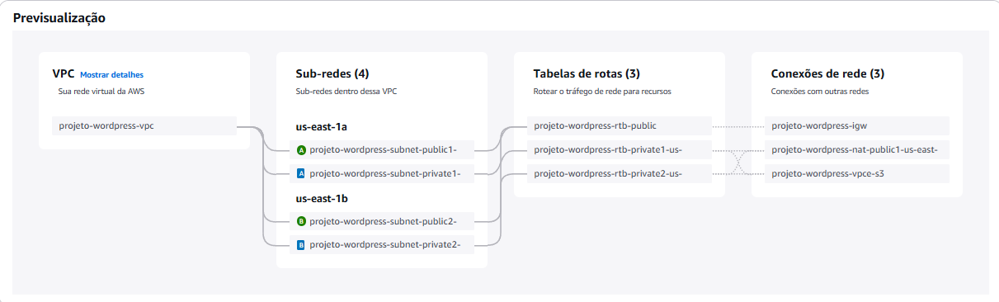
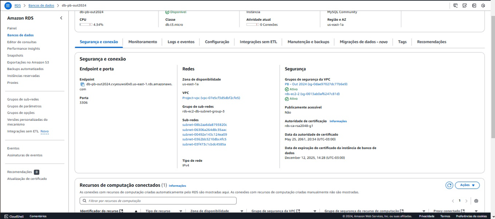
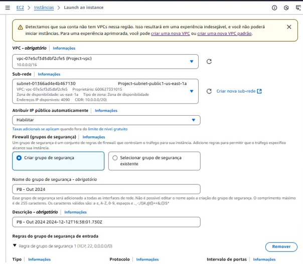
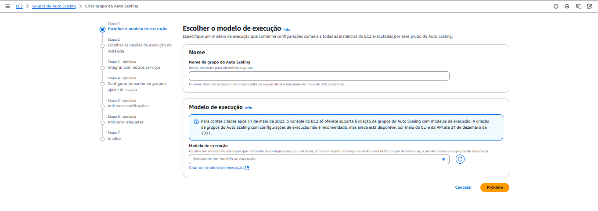
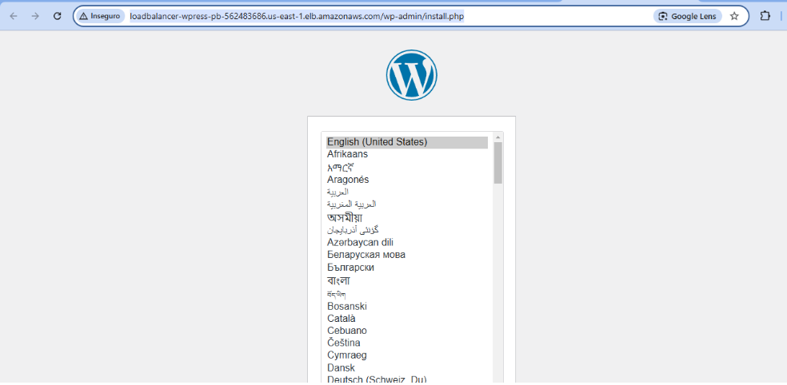

# 🚀 Deploy de uma Aplicação WordPress com Docker na AWS

Este projeto apresenta um passo a passo completo para realizar o **deploy de uma aplicação WordPress** utilizando **Docker** em um ambiente escalável e seguro na **AWS**.

A arquitetura implementa as melhores práticas, incluindo o uso de:
- **Duas instâncias EC2** para executar os contêineres da aplicação.
- **AWS RDS MySQL** como banco de dados relacional.
- **AWS EFS** para armazenamento persistente de arquivos estáticos.
- **Elastic Load Balancer (ELB)** para gerenciar o tráfego e garantir alta disponibilidade.
- **Auto Scaling** para ajuste dinâmico de recursos.
- **Bastion Host** para acesso seguro às instâncias privadas.
- **O arquivo .service** automatiza a montagem do EFS e a inicialização do Docker Compose, garantindo que os contêineres da aplicação sejam executados automaticamente após reinicializações, mantendo a alta disponibilidade e integração com os recursos da AWS.

Atende também aos requisitos de instalação e configuração do Docker ou Containerd no host EC2, deploy da aplicação WordPress com contêineres e configuração dos serviços da AWS como EFS e Load Balancer.


---

## 🔑 Diferenciais

- **Automação com script `user_data.sh`** para configurar e iniciar as instâncias EC2 automaticamente.
- **Arquitetura modular e reutilizável**, ideal para projetos empresariais e educacionais.
- **Escalabilidade** e **alta disponibilidade** utilizando AWS.

---

## 📐 Arquitetura da Solução

### 🎯 **Instâncias EC2**
- **Função**: Hospedar os contêineres Docker com a aplicação WordPress.
- **Benefícios**: Alta flexibilidade e escalabilidade para atender diferentes demandas.

### 🔒 **Bastion Host**
- **Função**: Facilitar acesso SSH seguro às instâncias EC2 privadas.
- **Benefícios**: Segurança aprimorada, evitando exposição de instâncias privadas à internet.

### 📊 **Banco de Dados (RDS MySQL)**
- **Função**: Banco de dados relacional para armazenar dados dinâmicos (usuários, posts, configurações).
- **Benefícios**: Solução gerenciada, com backups automáticos e escalabilidade.

### 🗂️ **Elastic File System (EFS)**
- **Função**: Sistema de arquivos compartilhado para armazenar arquivos estáticos (imagens, plugins).
- **Benefícios**: Persistência de dados e montagem simultânea em várias instâncias EC2.

### 📡 **Elastic Load Balancer (ELB)**
- **Função**: Distribuir o tráfego entre as instâncias EC2 para melhorar desempenho e resiliência.
- **Benefícios**: Alta disponibilidade e redirecionamento para instâncias saudáveis.

### 📈 **Auto Scaling**
- **Função**: Ajustar automaticamente o número de instâncias EC2 conforme a demanda.
- **Benefícios**: Otimização de custos e alta disponibilidade.

### 🔧 **Arquivo .service**
- **Função**: O arquivo .service automatiza a montagem do EFS e a inicialização do Docker Compose após a reinicialização da instância EC2.
- **Benefícios**: Garante alta disponibilidade e resiliência operacional da aplicação WordPress, eliminando a necessidade de intervenções manuais.

---

## 🚨 Requisitos da Proposta

Este projeto atende aos seguintes requisitos especificados na proposta:

### 1. **Instalação e Configuração do Docker no Host EC2**
- A instalação do **Docker** e do **Docker Compose** é realizada automaticamente via **script `user_data.sh`** na criação da instância EC2.
- O Docker é instalado e configurado para executar a aplicação WordPress.

### 2. **Deploy de uma Aplicação WordPress com Container de Aplicação e RDS MySQL**
- O **WordPress** é executado em um **contêiner Docker**, com o banco de dados **RDS MySQL** configurado.
- O arquivo `docker-compose.yml` configura o ambiente de contêiner para o WordPress e define o uso do banco de dados RDS.

### 3. **Configuração do Serviço EFS para Arquivos Estáticos**
- O **Elastic File System (EFS)** é utilizado para armazenar arquivos estáticos, como imagens e plugins do WordPress, garantindo persistência e compartilhamento entre instâncias EC2.

### 4. **Configuração do Serviço de Load Balancer AWS**
- O **Elastic Load Balancer (ELB)** é configurado para distribuir o tráfego de rede entre as instâncias EC2 do WordPress.
- O tráfego externo chega ao Load Balancer, que então distribui para as instâncias EC2 sem expor IP público diretamente.

### 5. **Evitar IP Público para o WordPress**
- As instâncias EC2 do WordPress são configuradas em **sub-redes privadas**, garantindo que não utilizem IP público.
- O **Load Balancer** é utilizado para gerenciar o tráfego e garantir que o WordPress esteja acessível apenas através dele.

### 6. **Aplicação WordPress Rodando nas Portas 80 ou 8080**
- O WordPress está configurado para rodar na **porta 80** dentro do contêiner Docker, conforme especificado no arquivo `docker-compose.yml`.

---

## 🚀 Etapas para Configuração

### **1️⃣ Criar VPC e Configurar Redes**
1. Acesse o console AWS e navegue até **VPC e mais**.
2. Configure:
   - Uma **VPC** com **duas zonas de disponibilidade (AZs)**.
   - **Duas sub-redes privadas** e **duas públicas**.
   - **Gateway NAT** para comunicação segura com a internet.
   - Um **Internet Gateway**.
3. Salve as configurações.



---

### **2️⃣ Configurar Grupos de Segurança (SGs)**

| Serviço      | Porta | Protocolo | Origem                        |
|--------------|-------|-----------|-------------------------------|
| Bastion Host | 22    | SSH       | Seu IP público (IP confiável) |
| EC2          | 80    | HTTP      | Grupo do Load Balancer        |
| EC2          | 443   | HTTPS     | Grupo do Load Balancer        |
| EC2          | 22    | SSH       | 0.0.0.0/0 (ou IP confiável)   |
| RDS MySQL    | 3306  | MySQL     | Grupo de Segurança da EC2     |
| EFS          | 2049  | NFS       | Grupo de Segurança da EC2     |
| Load Balancer| 80    | HTTP      | 0.0.0.0/0                     |

.png)

---

### **3️⃣ Configurar EFS**
1. Navegue até o serviço EFS e crie um sistema de arquivos.
Configure:
2. Use o grupo de segurança do EFS para controlar o acesso.
Monte o EFS nas instâncias EC2 usando:

    ```bash
    sudo mount -t nfs4 -o nfsvers=4.1,rsize=1048576,wsize=1048576,hard,timeo=600,retrans=2,noresvport fs-XXXXX.efs.us-east-1.amazonaws.com:/ /mnt/efs
3. Coloque a montagem no seu script ```use_date.sh```.
4. Certifique-se de que o EFS está na mesma região da sua instância EC2


---
### **4️⃣ Configurar Banco de Dados (RDS MySQL)**
1. Navegue até o serviço RDS e escolha **Criar Banco de Dados**.
2. Configure:
   - Tipo: **MySQL**.
   - Modelo: **Nível Gratuito** ou conforme necessidade.
   - Identificadores: Nome do DB, usuário e senha.
   - Instância: **db.t3.micro** (ou maior, dependendo da carga).
   - Acesso: Desabilitar **Acesso Público** e usar o SG específico.
3. Após criar, anote o **Endpoint do Banco de Dados**.



---

### **5️⃣ Adicionar Bastion Host**
**1. Criar Instância Bastion Host**
   * Lançar uma nova instância EC2 em uma sub-rede pública.
   * Tipo: ```t2.micro``` (ou conforme necessidade).
   * Configurar um **Security Group** para permitir tráfego SSH (porta 22) a partir de seu IP (ou outro IP de confiança).

**2. Configurar Security Group para Bastion Host**
   * Adicionar uma regra de entrada para permitir tráfego SSH (porta 22) a partir de seu IP público.
   * Adicionar uma regra de saída permitindo tráfego para todas as instâncias privadas na VPC.

**3. Configurar Security Group das Instâncias EC2 Privadas**
   * Atualizar o Security Group das instâncias privadas para permitir tráfego SSH (porta 22) a partir do Security Group do Bastion Host.

**4. Configurar o SSH para Usar o Bastion Host**

* Configure o arquivo ```~/.ssh/config``` no seu computador local usando ```nano```:
    ```bash
    nano ~/.ssh/config

Adicione as seguintes configurações:
    
    Host bastion-host
        HostName <BASTION_HOST_PUBLIC_IP>
        User ec2-user
        Port 22
        IdentityFile ~/.ssh/seu-arquivo-chaves.pem
        IdentitiesOnly yes
    Host private-ec2
        HostName <PRIVATE_EC2_PRIVATE_IP>
        User ec2-user
        Port 22
        IdentityFile ~/.ssh/seu-arquivo-chaves.pem
        IdentitiesOnly yes
        ProxyJump bastion-host

**Substitua** ```<BASTION_HOST_PUBLIC_IP>``` pelo IP público do seu Bastion Host e ```<PRIVATE_EC2_PRIVATE_IP>``` pelo IP privado da sua instância EC2 privada. Também substitua ```~/.ssh/seu-arquivo-chaves.pem``` pelo caminho para o arquivo de chave SSH que você usa para acessar suas instâncias EC2.

* Salve e feche o arquivo no ```nano```:

    * Pressione ```CTRL + O``` para salvar o arquivo.
    * Pressione ```ENTER``` para confirmar.
    * Pressione ```CTRL + X``` para sair do ```nano```.

**5. Conectar ao Bastion Host**

* Primeiro, conecte-se ao Bastion Host:
    ```bash	
    ssh bastion-host

* A partir do Bastion Host, conecte-se à instância privada:
    ```bash
    ssh private-ec2
    
---

### **6️⃣ Criar Instância EC2 e Configurar Inicialização**



1. Escolha o AMI: **Amazon Linux 2023**.
2. Configure:
   - Tipo: **t2.micro** (ou maior).
   - Sub-rede: Escolha uma **privada**.
   - Desative IP Público automático.
   - Adicione o **script de inicialização**:

      ```bash
      #!/bin/bash

      set -e
      
      # Atualizar pacotes e instalar dependências
      sudo dnf update -y
      sudo dnf install -y docker nfs-utils
      sudo systemctl start docker
      sudo systemctl enable docker
      
      # Adicionar o usuário ao grupo docker
      sudo usermod -aG docker $USER
      
      # Instalar o Docker Compose
      DOCKER_COMPOSE_VERSION=$(curl -s https://api.github.com/repos/docker/compose/releases/latest | grep '"tag_name":' | sed -E 's/.*"([^"]+)".*/\1/')
      DOCKER_COMPOSE_PATH="/usr/local/bin/docker-compose"
      
      if ! command -v docker-compose &> /dev/null; then
          echo "docker-compose não encontrado. Instalando..."
          sudo curl -L "https://github.com/docker/compose/releases/download/$DOCKER_COMPOSE_VERSION/docker-compose-$(uname -s)-$(uname -m)" -o $DOCKER_COMPOSE_PATH
          sudo chmod +x $DOCKER_COMPOSE_PATH
      fi
      
      # Criar diretório da aplicação
      APP_DIR="/app"
      sudo mkdir -p $APP_DIR
      
      # Criar o arquivo docker-compose.yml
      COMPOSE_FILE="$APP_DIR/compose.yml"
      cat <<EOF | sudo tee $COMPOSE_FILE > /dev/null
      version: '3.7'
      services:
        wordpress:
          image: wordpress:latest
          restart: always
          ports:
            - "80:80"
          environment:
            WORDPRESS_DB_HOST: database.cvyesuwsi0x0.us-east-1.rds.amazonaws.com
            WORDPRESS_DB_USER: admin
            WORDPRESS_DB_PASSWORD: password
            WORDPRESS_DB_NAME: wordpressdb
          volumes:
            - /mnt/efs:/var/www/html
      EOF
      
      # Criar o ponto de montagem do EFS
      EFS_MOUNT_POINT="/mnt/efs"
      sudo mkdir -p $EFS_MOUNT_POINT
      sudo mount -t nfs4 -o nfsvers=4.1,rsize=1048576,wsize=1048576,hard,timeo=600,retrans=2,noresvport fs-001b7051e49e1d14f.efs.us-east-1.amazonaws.com:/ $EFS_MOUNT_POINT
      
      # Subir os containers com o docker-compose
      docker-compose -f /app/compose.yml up -d
      
      # Criar o arquivo de serviço systemd para o docker-compose
      sudo tee /etc/systemd/system/wordpress-docker.service > /dev/null <<EOF
      [Unit]
      Description=Start WordPress Docker Containers
      After=network.target docker.service
      Requires=docker.service
      
      [Service]
      Type=simple
      Restart=always
      WorkingDirectory=/app
      ExecStart=$DOCKER_COMPOSE_PATH up -d
      ExecStop=$DOCKER_COMPOSE_PATH down
      TimeoutStartSec=0
      
      [Install]
      WantedBy=multi-user.target
      EOF
      
      # Definir permissões adequadas para o arquivo de serviço
      sudo chmod 644 /etc/systemd/system/wordpress-docker.service
      
      # Recarregar o daemon do systemd e habilitar o serviço
      sudo systemctl daemon-reload
      sudo systemctl enable wordpress-docker.service
      sudo systemctl start wordpress-docker.service
            
--- 

### **7️⃣ Configurar Load Balancer (ELB)**
1. Acesse o serviço ELB e crie um Load Balancer:
    * Tipo: Application Load Balancer (Internet-facing).
    * No caminho do pring acrescentar ```/wp-admin/install.php```.
    * Configure listeners para redirecionar tráfego HTTP (porta * 80).
    * Use o SG do Load Balancer e registre as instâncias EC2.


---

### **8️⃣ Configurar Auto Scaling**
1. Configure um grupo de Auto Scaling:
    * Min: 2 instâncias.
    * Max: 6 instâncias (ou conforme necessário).
    * Configuração de verificação de integridade baseada no ELB.
2. Adicione políticas de escalação com base em métricas como uso de CPU.



---
   
### **🎉 Testando e Validando**
1. **Acesso Inicial ao WordPress**
   * Após concluir todas as configurações e iniciar suas instâncias, acesse o endereço público do Load Balancer.
   * Verifique se a página de instalação do WordPress é exibida.

2. **Completar a Instalação do WordPress**
   * Siga as instruções na tela para completar a instalação do WordPress.
   * Insira os detalhes do banco de dados conforme configurado no seu ```docker-compose.yml```:
        * Host do banco de dados (```WORDPRESS_DB_HOST```).
        * Usuário do banco de dados (```WORDPRESS_DB_USER```).
        * Senha do banco de dados (```WORDPRESS_DB_PASSWORD```).
        * Nome do banco de dados (```WORDPRESS_DB_NAME```).

3. **Verificar Porta de Execução**
   * A aplicação WordPress deve estar rodando na porta 80 ou 8080, conforme configurado no arquivo ```docker-compose.yml```.
   * Certifique-se de que as portas estão abertas no Security Group e que o Load Balancer está redirecionando corretamente para as instâncias EC2.

4. **Acessar a Tela de Login do WordPress**
   * Após completar a instalação, acesse a tela de login do WordPress via ```http://<seu-load-balancer-endereco>/wp-login.php```.
   * Verifique se a tela de login é exibida e que você pode acessar o painel de administração do WordPress.




---

### 📚 **Referências e Materiais Adicionais** 
* [Documentação do WordPress](https://wordpress.org/documentation/)
* [Docker Hub - WordPress Image](https://hub.docker.com/_/wordpress) 
* [Documentação AWS](https://docs.aws.amazon.com/)
